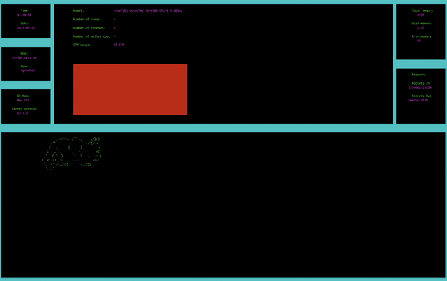

# ft_gkrellm

Simple implementation system monitor like a GKrellM.

## Module

1. Hostname/username module
2. OS info module
3. Date/time module
4. CPU module (Model, clock speed, number of cores, activity, ...)
5. RAM module
6. Network throughput module

#### To try run in your terminal ./ft_gkrellm

## Code

1. C++

### Demo
